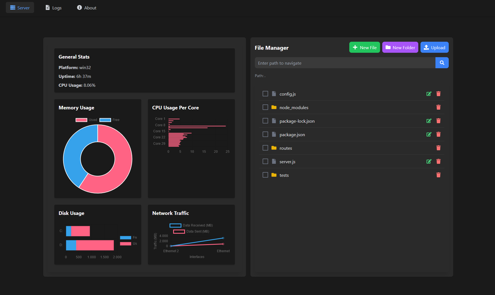

# Esd.ServerManager

**Esd.ServerManager** is a simple, lightweight server management tool developed for fun. It helps with basic server management tasks such as monitoring server stats, managing files, and viewing logs.

## Features

- **Server Stats**: Monitor CPU usage, memory usage, network traffic, and disk space.
- **File Manager**: Upload, download, edit, and delete files directly from the browser.
- **Logs Viewer**: View real-time logs of specific system services.

## Technology Stack

- **Frontend**: React, Vite, Tailwind CSS
- **Backend**: Express.js
